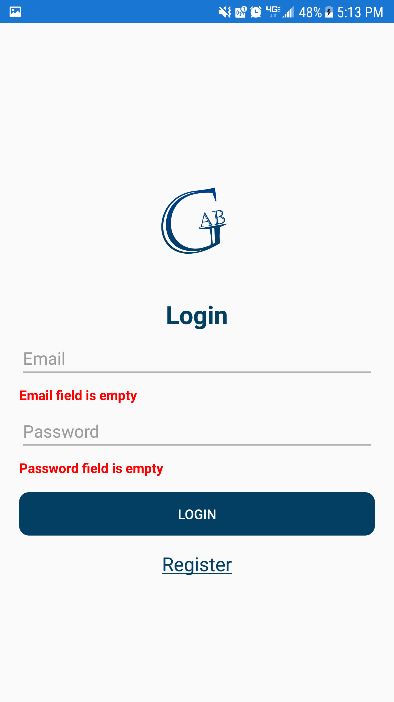
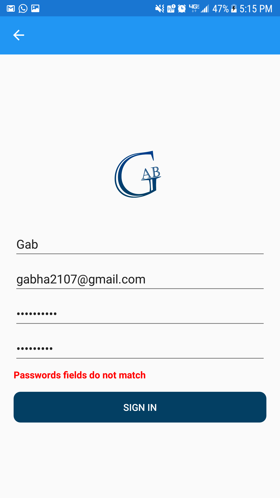

# XamarinFormCourse
An amazing course of Xamarin Forms with Charlin Agramonte (Xamgirl).

## LoginPage
The login page have:
- Logo.
- Login label.
- Two entrys for email and password.
- A buttton that runs the authentications.

## RegisterPage
This is a Signup page that have the logo, 4 entrys and a Sign in button:

## MasterDetailPage
And this is a MasterDetailPage Made by fun :D
We will use it in the following branches, don't worry.

