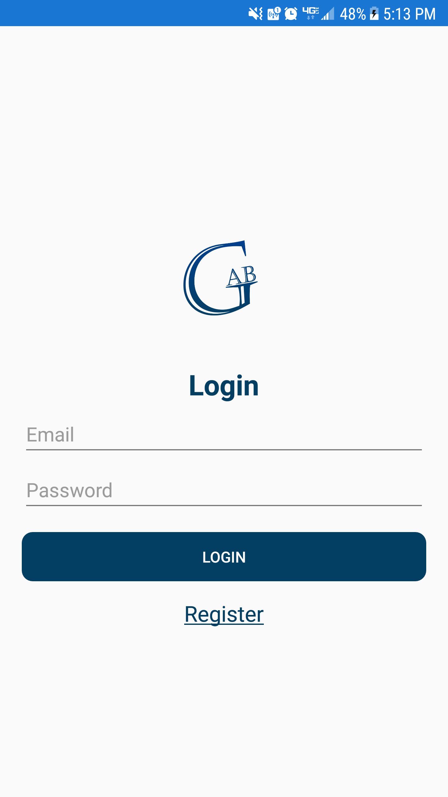
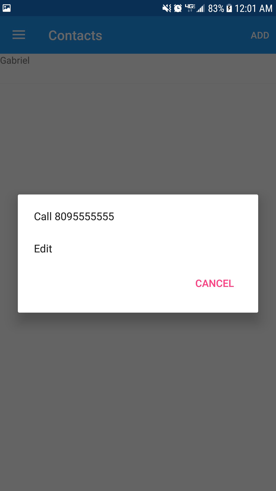

# XamarinFormCourse
An amazing course of Xamarin Forms with Charlin Agramonte (Xamgirl).

## LoginPage
The login page that have a logo, login label, two entrys for email and password,   
a buttton that runs the authentications and a Register label clickable to Sign up a new account.

## RegisterPage
This is a Signup page that have the logo, 4 entrys and a Sign in button:

## MasterDetailPage
And this is a MasterDetailPage Made by fun :D    
We will use it in the following branches, don't worry.

## ContactsPage
A new page with a list of contacts, an add button for new contacts and two more buttons pressing the contact for android and swiping for ios:

## AddPage
A new page to add contacts if needed whit the following fields:

## EditPage
A new page to edit the contacts if needed:

## More Options
Like i mentioned befor there are two more options the first one (More) that popup the call and edit options and the second one (Delete) the name says it all:

